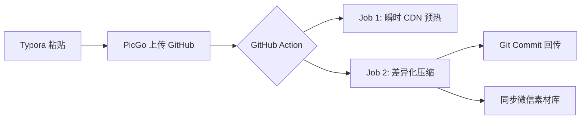

# 🖼️ Blog Images Box (V2.0)

<p align="center">
  
  
  
  <br>
  
  
</p>

> **极致优雅的开源图床解决方案**。集成 **Typora + PicGo + GitHub Actions + 微信公众号同步**。
> 别再手动压缩和搬运图片了，让流水线为你打理一切。

[English](./README_EN.md) | 中文说明

---

## 💡 核心流程图 (Workflow)



## 💡 为什么需要它？ (解决的痛点)


作为博主或开发者，你是否厌倦了以下流程？
- ❌ **图片太大**：手动压缩太累，不压缩 CDN 流量费太贵。
- ❌ **同步繁琐**：GitHub 上传了，还得手动去微信公众号后台再传一遍。
- ❌ **访问慢**：GitHub Raw 访问不稳定，CDN 预热全靠手动刷新。
- ❌ **IP 限制**：微信 API 有 IP 白名单，GitHub Actions 的动态 IP 根本没法用。

**Blog Images Box** 专为解决这些问题而生！🚀

---

## ✨ 核心特性

- ⚡ **快慢路径并行 Job**：CDN 预热 (Fast) 与 压缩同步 (Background) 并行，提速 200%。
- 📦 **Typora + PicGo 集成**：本地截图，一键粘贴，GitHub 自动处理。
- 📉 **智能增量压缩**：使用 `jpegoptim` / `optipng`，仅针对新增图片，大小立减 60%+。
- 📲 **公众号自动化同步**：通过中转服务器彻底绕过微信 IP 白名单限制。
- 🛡️ **安全隔离架构**：支持 `github-bot` 专用账户，免除腾讯云异地登录告警，保护 root 安全。
- 🔄 **幂等同步 (Registry)**：内置 MD5 校验，避免重复上传，节省微信素材空间。
- 📁 **每日壁纸存档**：自动抓取 Bing/Unsplash 每日壁纸。

---

## 📂 目录结构

```text
.
├── .github/workflows/      # 🚀 高级并行流水线
├── blog/                   # 📷 博客图片存储 (Typora 默认路径)
├── wallpapers/             # 🎨 每日壁纸存档
├── scripts/                # 🐍 核心同步脚本 (Python)
└── docs/                   # 📄 GitHub Pages 静态文档
```

---

## 🚀 快速开始

### 1. 基础配置
1. **Fork** 本仓库。
2. 配置 Typora + PicGo (GitHub 插件)，将上传地址指向您的仓库。

### 2. GitHub Secrets 配置
在 **Settings -> Secrets -> Actions** 中添加：

| Secret 名称 | 含义 | 说明 |
| :--- | :--- | :--- |
| `CDN_DOMAIN` | CDN 域名 | 如 `img.example.com` |
| `WECHAT_APP_ID` | 微信 AppID | 公众号后台查看 |
| `WECHAT_APP_SECRET`| 微信 AppSecret| 公众号后台查看 |
| `SERVER_HOST` | 中转服务器 IP | 您的托管服务器公网 IP |
| `SERVER_USER` | SSH 用户 | **强烈建议使用 `github-bot`** |
| `SERVER_KEY` | SSH 私钥 | 私有密钥内容 |

> ⚠️ **重要提示 (微信白名单)**：
> 您必须前往 **[微信公众平台] -> 设置与开发 -> 基本配置 -> IP白名单**，将您的**中转服务器公网 IP**（即 `SERVER_HOST`）加入白名单。否则同步脚本将无法获取 Access Token。


---

## 🛡️ 安全加固方案 (推荐)

为了避免 GitHub Actions 全球节点连接您的腾讯云服务器触发“异地登录告警”，建议执行以下操作：

1. **新建专用账户**：
   ```bash
   # 在服务器执行
   adduser github-bot
   ```
2. **权限限制**：
   将该用户限制在只能操作 `~/blog-sync` 目录。
3. **部署密钥**：
   按照下方“密钥教程”将公钥部署给 `github-bot` 用户。
4. **腾讯云白名单**：
   在腾讯云主机安全后台，对 `github-bot` 用户**免除异地登录告警**。即使 IP 来自美国或新加坡，由于是指定用户且仅限特定目录，系统将不再频繁误报。

---

## 🔑 SSH 密钥配置教程

1. **生成 PEM 格式密钥** (兼容性最高)：
   ```bash
   ssh-keygen -t rsa -b 4096 -m PEM -f ./id_rsa_github -N ""
   ```
2. **部署公钥**：
   ```bash
   ssh-copy-id -i ./id_rsa_github.pub github-bot@您的服务器IP
   ```
3. **本地验证**：
   ```bash
   ssh -i ./id_rsa_github github-bot@您的服务器IP
   ```

---

## 🛠️ 本地调试

```bash
# 复制并配置环境
cp .env.example .env
# 运行同步测试
python3 scripts/sync_to_wechat.py "blog/test.jpg"
```

---

## 📝 Roadmap

- [ ] 支持更多中转协议 (如 HTTP Proxy)。
- [ ] 增加图片水印自动添加功能。
- [ ] 支持阿里云 OSS / 腾讯云 COS 同步。

---

**Proudly powered by GitHub Actions & Cloudflare.**
If you like it, please give a ⭐️!
